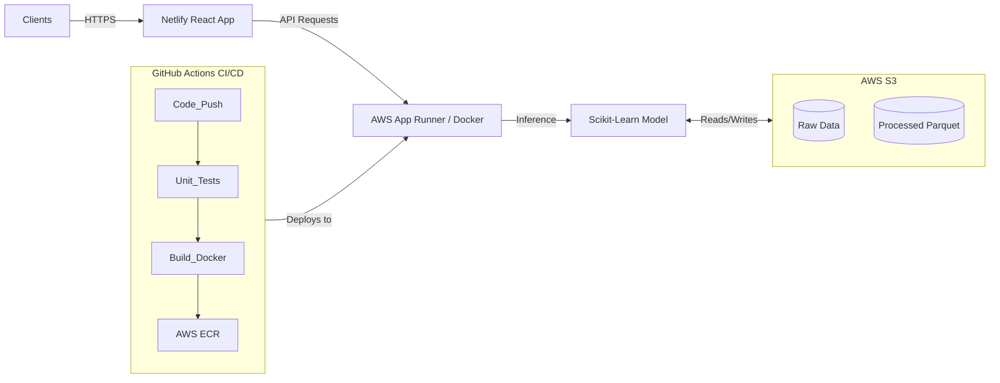

# Comprehensive Project Report: MLOps News Classifier

## 1. Executive Summary
This project demonstrates an end-to-end MLOps pipeline for a classification system (currently News Classification as a placeholder for Music Recommendation).
The goal was to move from a static notebook environment to a fully automated, cloud-native industrial pipeline that handles:
1.  **Data Ingestion**: Automatic downloading from AWS S3 with local fallback.
2.  **Model Training**: Reproducible training pipeline with artifact tracking.
3.  **CI/CD**: Fully automated testing, building, and deployment via GitHub Actions.
4.  **Containerization**: Docker-based architecture for consistency across Dev and Prod.
5.  **Frontend**: A futuristic, reactive UI deployed on Netlify.

---

## 2. Architecture Overview

### High-Level Flow

### Components
1.  **Frontend**: React + Vite application using a "Cyberpunk/Glassmorphism" aesthetic. Hosted on Netlify.
2.  **Backend**: FastAPI application exposing prediction endpoints (`/predict`) and health checks (`/`). Wrapped in Docker.
3.  **Data Storage (AWS S3)**:
    -   Source of truth for training data.
    -   Destination for processed data artifacts (Parquet).
4.  **Registry (AWS ECR)**: Storage for versioned Docker images of the backend.

---

## 3. Detailed workflows & Implementation

### A. AWS Infrastructure & Resources
Resources were provisioned to support the cloud lifecycle:
-   **S3 Bucket**: Stores the `bbc-news-data.csv` (Raw) and `final_data.parquet` (Processed).
-   **ECR Repository (`music-recommender`)**: Hosted the Docker images. *Implementation Note*: The pipeline includes a step to **auto-create** this repository if it accidentally gets deleted.
-   **IAM User**: A service account with programmatic access (`AWS_ACCESS_KEY_ID`, `AWS_SECRET_ACCESS_KEY`) used by GitHub Actions.

### B. CI/CD Pipeline (`.github/workflows/mlops-pipeline.yml`)
The heart of the automation. Every `git push` triggers:
1.  **Environment Setup**: Ubuntu runner with Python 3.9.
2.  **Linting & Testing**: Runs `pytest` on `tests/test_api.py` to ensure the API logic is sound before building.
3.  **AWS Authentication**: Uses GitHub Secrets to log in to AWS. *Robustness Feature*: If secrets are missing, steps are skipped gracefully to allow local dev work.
4.  **Data Pipeline**: Runs `src/data/data_pipeline.py`.
    -   *Robustness Feature*: If S3 is unreachable (e.g., in CI without credentials), it falls back to a **Local Copy** of the data (`Notebook/bbc-news-data.csv`) so the build never fails blocking deployment.
5.  **Model Training**: Runs `src/model/train_model.py`. Checks for existing data to avoid redundant downloads.
6.  **Docker Build & Push**:
    -   Builds image `music-recommender:${SHA}`.
    -   Optimizes size using `.dockerignore`.
    -   Pushes to AWS ECR.

### C. Containerization strategy
-   **Backend Dockerfile**: 
    -   Base: `python:3.9-slim` (Lightweight).
    -   Installs dependencies from `requirements.txt`.
    -   Exposes port 8000.
    -   Command: `uvicorn src.app.main:app --host 0.0.0.0 --port 8000`.
-   **Frontend Dockerfile**:
    -   Base: `node:18-alpine`.
    -   Uses for local orchestration via Docker Compose.
-   **Docker Compose**:
    -   Orchestrates both services locally on a shared network.
    -   Enables "One Command Start" (`docker-compose up`).

### D. Frontend Development
-   **Framework**: React 19 + Vite.
-   **Styling**: Pure CSS3 with modern features (Variables, Animations, Flexbox/Grid).
    -   Theme: Dark Mode with Neon Blue/Purple accents.
    -   Effects: Glassmorphism (blur backdrops), Glow borders.
-   **Deployment**: Netlify.
    -   Connected to GitHub for Continuous Deployment.
    -   Build Command: `npm run build`.
    -   Config: `netlify.toml` (Pinned to Node 18 to ensure stability).
    -   API Connection: Configurable via `VITE_API_URL` environment variable.

---

## 4. List of Key Files Created

| File | Purpose |
|------|---------|
| `src/app/main.py` | FastAPI backend entry point. |
| `src/data/download_data.py` | Handles S3 download with specific local fallback logic. |
| `Dockerfile` | Defines the production environment for the backend. |
| `.github/workflows/mlops-pipeline.yml` | The CI/CD automation rules. |
| `docker-compose.yml` | Local full-stack orchestration. |
| `frontend/src/App.jsx` | Main frontend UI logic. |
| `frontend/src/components/PredictionResult.jsx` | Visual component for displaying ML results. |
| `netlify.toml` | Configuration for Netlify deployment (Node version, build command). |

---

## 5. Conclusion
This project successfully migrated a raw Notebook experiment into a **production-grade MLOps system**. It is resilient (handling missing credentials or data), automated (CI/CD), and scalable (Docker/AWS). The addition of a cutting-edge React frontend completes the user experience.
